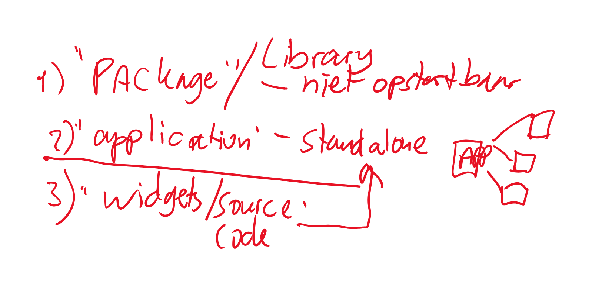
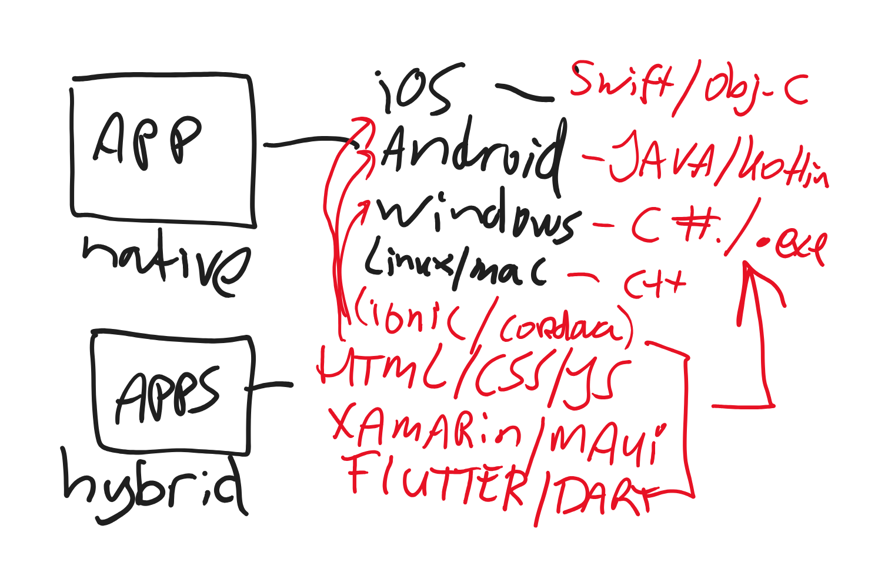

# maritiem

Slides and sample code on the training Flutter Fundamentals, Maritieme IT, 2025

## Links

- General Flutter Fundamentals Repo: https://github.com/PeterKassenaar/flutter-fundamentals
## From series 3

- ...
- 

## From series 2
- 
- 

## From series 1

- Dart Extension Methods: https://dart.dev/language/extension-methods
    - Extension methods allow you to literally 'Extend' existing classes with new functionality. See page above and
      YouTube video at https://www.youtube.com/watch?v=D3j0OSfT9ZI.

Questions, or booking a training for your own company? Email me at info@kassenaar.com

- Cheers, Peter.
