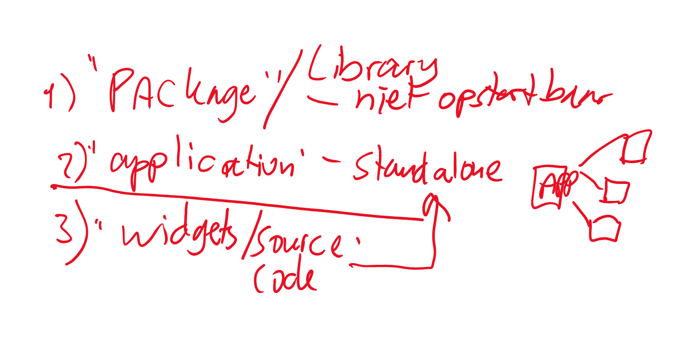
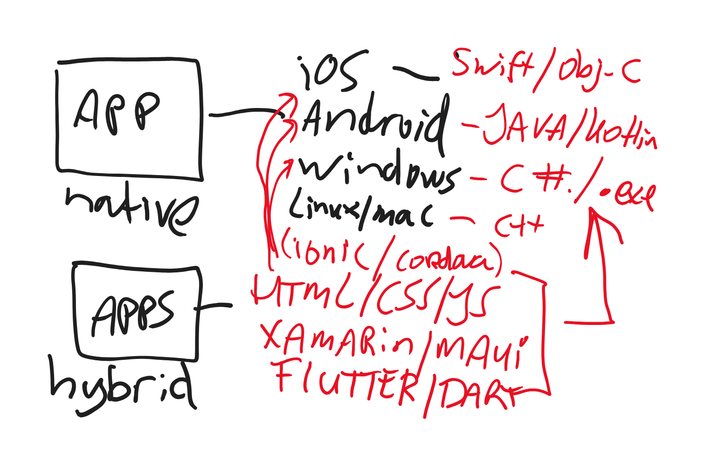

# maritiem

Slides and sample code on the training Flutter Fundamentals, Maritieme IT, 2025

## Links

- General Flutter Fundamentals Repo: https://github.com/PeterKassenaar/flutter-fundamentals

## From series 5 (5-7 November 2025)
- Background on the Spread operator (`...`). Note: this is ONE operator, consisting of three dots. https://www.geeksforgeeks.org/dart/dart-spread-operator/
- Blog article `The power of the 'late' keyword`: https://thiele.dev/blog/the-power-of-late-keyword-in-dart/
- 

## From series 4 (17 - 19 September 2025)

- When experiencing 'Handshake failed' errors, while talking to an API, try the solution on this page: https://stackoverflow.com/questions/54285172/how-to-solve-flutter-certificate-verify-failed-error-while-performing-a-post-req/61312927#61312927. 
  - (update `main.dart` with the given code, your request should now work).

## From series 3 (21 - 23 May 2025)

- Slides with recap on day #1 available - extra: using `const`; using `final` vs `const`, on keywords `private`, `public` and `protected`.

## From series 2 (7 - 9 May 2025)
- 
- 

## From series 1 (2 - 4 April 2025)

- Dart Extension Methods: https://dart.dev/language/extension-methods
    - Extension methods allow you to literally 'Extend' existing classes with new functionality. See page above and
      YouTube video at https://www.youtube.com/watch?v=D3j0OSfT9ZI.

Questions, or booking a training for your own company? Email me at info@kassenaar.com

- Cheers, Peter.
